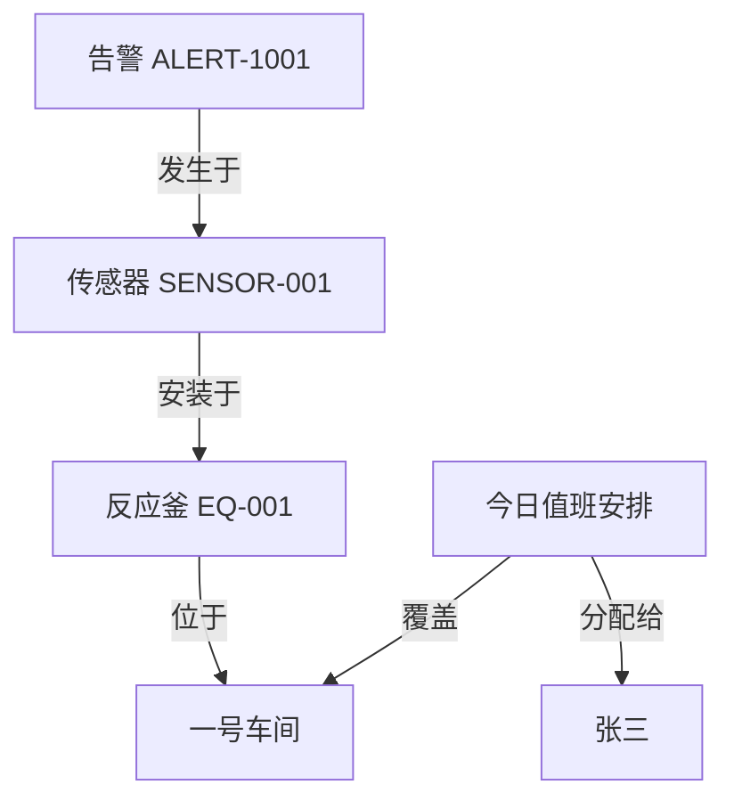
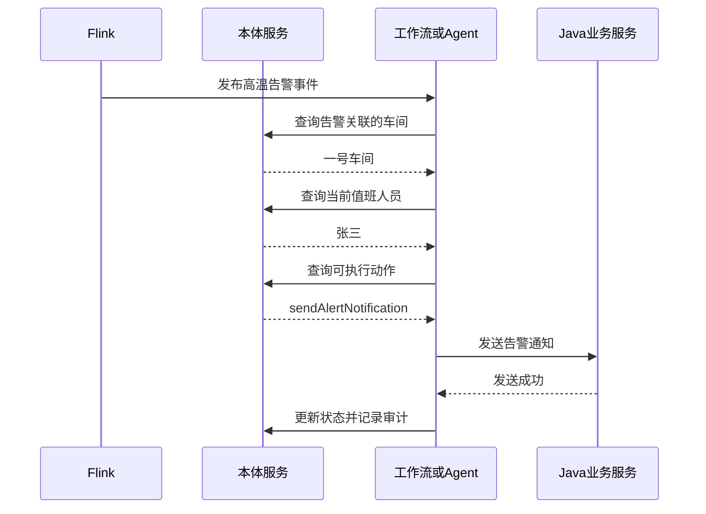
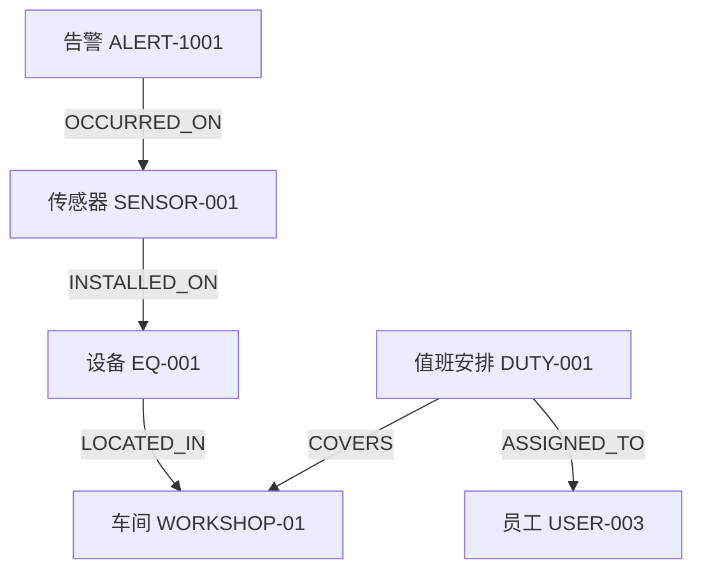
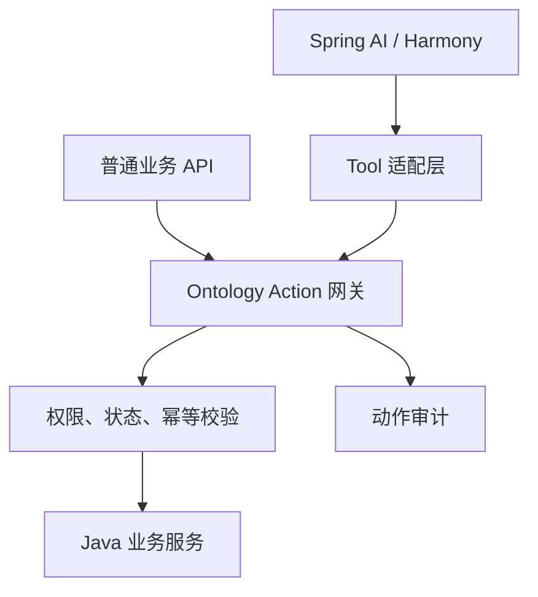

>  什么是“本体论”？这个概念最近很火（吗？）反正我的领导天天在群里发这个东西，做为一个有理想有信念的程序员当然是对这些东西不屑一顾的。但是我在花了点时间深入了解后，我觉得这可能是一种全新的开发理念。

先看下概念：

**本体论（Ontology）**是将分散的业务数据、业务对象、算法能力与系统操作，梳理、整合为统一的业务语义语言，让系统具备理解真实业务、合规高效执行任务的能力。

本体论并非是在现有系统之外新增一套独立概念库，而是类似于新加了一个服务，作用是把企业分散在系统、文件和人员经验中的业务概念，整理成一套人和机器都能共同理解、持续复用的“业务世界模型”。

它回答六个基本问题：

1. 企业中有哪些业务对象？
2. 每个对象是什么意思？
3. 对象之间有什么关系？
4. 这些关系在什么条件和时间下成立？
5. 数据来自哪个系统、可信程度如何？
6. AI可以依据哪些关系和规则进行检索、分析和决策？

## 为什么需要本体论？现在的系统有什么问题？

我用下面一个场景来举个例子：“传感器持续高温通知值班人员”。

假设工厂里真实存在这些数据：

- 温度传感器 `SENSOR-001`
- 安装在反应釜 `EQ-001`
- 反应釜位于一号车间 `WORKSHOP-01`
- 今天`张三`负责一号车间
- 传感器产生高温告警 `ALERT-1001`

各系统可能只有一些互不相干的数据表：

```text
tb_sensor
SENSOR-001 | EQ-001 | temperature

tb_equipment
EQ-001 | WORKSHOP-01 | 反应釜

tb_duty
2026-07-30 | WORKSHOP-01 | USER-003

tb_user
USER-003 | 张三 | 138xxxx0000

tb_alert
ALERT-1001 | SENSOR-001 | 95.6 | HIGH
```

程序员需要知道他们的关系：

```
tb_alert_event
  └── sensor_id
         │
         ▼
tb_sensor
  ├── id
  └── equipment_id
         │
         ▼
tb_equipment
  ├── id
  └── workshop_id
         │
         ▼
tb_duty
  ├── workshop_id
  └── user_id
         │
         ▼
tb_user
  └── id
```

但这些知识散落在表结构、代码和程序员脑子里，如果有一天这些东西太多了，程序员记不过来了，或者新人接手了项目、无法维护了，怎么办？如何避免这些问题，或提前规避风险？

这就需要迎接本体论了。

## 本体论为什么可以？

回答本体论为什么可以整合领域知识前，不妨先看看本体论在做什么：

### 定义本体类型

先把业务世界中存在的对象定义出来：

```yaml
objectTypes:
  Sensor:
    name: 传感器
    properties:
      id: string
      name: string
      metricType: enum
      currentValue: number
      unit: string

  Equipment:
    name: 设备
    properties:
      id: string
      name: string
      status: enum

  Workshop:
    name: 车间
    properties:
      id: string
      name: string

  Staff:
    name: 员工
    properties:
      id: string
      name: string
      phone: string

  DutySchedule:
    name: 值班安排
    properties:
      id: string
      dutyDate: date
      shift: enum

  AlertEvent:
    name: 告警事件
    properties:
      id: string
      type: enum
      level: enum
      value: number
      threshold: number
      status: enum
      occurredAt: datetime
```

这一步类似定义 Java 类，但还不够。本体的重点还包括对象之间的业务关系。

下面还需要继续定义每个对象间的关系。👇

### 定义关系

```yaml
relationTypes:
  installedOn:
    source: Sensor
    target: Equipment
    description: 传感器安装在哪台设备上

  locatedIn:
    source: Equipment
    target: Workshop
    description: 设备位于哪个车间

  assignedTo:
    source: DutySchedule
    target: Staff
    description: 值班安排分配给哪名员工

  covers:
    source: DutySchedule
    target: Workshop
    description: 值班安排负责哪个车间

  occurredOn:
    source: AlertEvent
    target: Sensor
    description: 告警发生在哪个传感器上
```

把真实对象填进去以后，会形成这样的业务关系：



因此系统可以沿关系查询：

```text
ALERT-1001
→ occurredOn
→ SENSOR-001
→ installedOn
→ EQ-001
→ locatedIn
→ WORKSHOP-01
→ 被今天的值班安排覆盖
→ assignedTo
→ 张三
```

这才是本体最核心的价值：**把原本隐含的业务关联变成统一、显式、可查询的语义关系**。

### 定义规则

确定性规则仍然由 Flink 或规则引擎执行：

```yaml
rule:
  code: TEMPERATURE_OVER_LIMIT
  targetType: Sensor

  condition:
    metricType: TEMPERATURE
    operator: GREATER_THAN
    threshold: 90
    durationSeconds: 10

  result:
    eventType: HIGH_TEMPERATURE_ALERT
    level: HIGH
```

规则触发后生成一个告警实例：

```json
{
  "id": "ALERT-1001",
  "objectType": "AlertEvent",
  "type": "HIGH_TEMPERATURE",
  "level": "HIGH",
  "value": 95.6,
  "threshold": 90,
  "status": "PENDING",
  "occurredAt": "2026-07-30T14:20:10+08:00",
  "relations": {
    "occurredOn": "SENSOR-001"
  }
}
```

注意：本体描述“告警发生在传感器上”，Flink 负责判断“连续十秒超过 90℃”。别把两者混为一谈。

### 定义动作

系统确定负责人以后，还要知道允许执行什么动作：

```yaml
actions:
  sendAlertNotification:
    name: 发送告警通知
    targetType: AlertEvent

    input:
      alertId:
        type: string
        required: true
      receiverId:
        type: string
        required: true
      channel:
        type: enum
        values: [SMS, PHONE, WECHAT]

    preconditions:
      - alert.status == PENDING
      - receiver.isOnDuty == true
      - currentUser.hasPermission("alert:notify")

    executor:
      type: HTTP
      method: POST
      endpoint: /api/notifications/alerts

    effects:
      - create NotificationRecord
      - alert.status = NOTIFIED

    audit:
      enabled: true
```

对应的 Java 服务仍然正常写：

```java
public interface AlertNotificationService {

    NotificationResult send(
        String alertId,
        String receiverId,
        NotificationChannel channel
    );
}
```

本体里的 Action 不是业务实现，而是这段业务能力的统一说明书：

- 动作叫什么；
- 针对什么对象；
- 需要哪些参数；
- 什么条件下允许执行；
- 最终调用哪个服务；
- 执行后产生什么影响；
- 是否记录审计。

### 实际运行过程

最终链路是：



如果流程固定，Agent 都可以删掉，直接由 Java 工作流执行。

如果流程动态，例如：

- 高危告警优先打电话；
- 一般告警发送企业微信；
- 五分钟未确认则通知班组长；
- 找不到值班人员则查询车间负责人；
- 同一设备频繁告警则自动创建工单；

这时才适合让 Agent 在本体和 Action 的约束下进行动态编排。

## 本体论对于程序员意味着什么？

可以近似理解成：

| 本体概念         | 开发中的对应物                |
| ---------------- | ----------------------------- |
| Object Type      | 领域对象、Java 类             |
| Property         | 对象字段                      |
| Object Instance  | 数据库中的具体记录            |
| Relation         | 外键、关联表、业务关系        |
| Constraint       | 校验规则、状态机、权限规则    |
| Action           | Application Service 或 API    |
| Action Schema    | 请求 DTO 和接口契约           |
| Executor         | Spring Bean、HTTP、MQ、工作流 |
| Effect           | 状态变更和领域事件            |
| Ontology Query   | 面向业务语义的统一查询        |
| Function Calling | AI 选择并调用 Action          |

本体论不只是“换个名字写 Java 类”。关键区别是：

> 普通业务代码里的语义主要服务于当前应用；
>
> 本体把对象、关系和动作提升成跨系统可发现、可查询、可治理的统一业务模型。

数据库需要至少定义如下的数据表：

```text
ontology_object_type       对象类型
ontology_property_def      属性定义
ontology_relation_type     关系类型
ontology_object_instance   对象实例索引
ontology_relation_instance 关系实例
ontology_action_def        动作定义
ontology_action_log        动作审计
```

## 本体论MVP项目示例

先做一个真正能跑的 MVP：只用 Spring Boot 3 + PostgreSQL，把“对象类型、对象实例、关系、动作”跑通。不用 RDF、OWL、Neo4j、Spring AI。

逻辑思路：

1. 用固定枚举定义少量本体类型和关系类型。
2. PostgreSQL 保存对象实例与关系实例。
3. 提供“按关系路径查询”的能力。
4. 把 Java Service 注册成 Action。
5. Action 执行前统一做参数、状态、权限校验。
6. 记录动作审计。
7. 最后再把这些 Action 暴露给 Spring AI Tool Calling。

这个阶段的重点不是做一个万能本体编辑器，而是验证：

> 能否从一个告警对象出发，沿业务关系找到当前值班人员，并执行通知动作。

### 业务链路

数据关系如下：



我们需要实现两个业务能力：

```
// 第一个接口沿本体关系寻找值班人员
GET  /api/ontology/alerts/{alertId}/duty-staff

// 第二个接口执行受控 Action
POST /api/ontology/actions/send-alert-notification/execute
```

### 项目目录结构

结合你现在 Java 项目的习惯，可以先这样分：

```text
ontology-demo
└── src/main/java/com/hzx/ontology
    ├── Application.java
    │
    ├── ontology
    │   ├── controller
    │   │   ├── OntologyQueryController.java
    │   │   └── OntologyActionController.java
    │   │
    │   ├── model
    │   │   ├── entity
    │   │   │   ├── OntologyObjectDO.java
    │   │   │   ├── OntologyRelationDO.java
    │   │   │   └── OntologyActionLogDO.java
    │   │   ├── request
    │   │   │   └── ExecuteActionReq.java
    │   │   └── response
    │   │       ├── OntologyObjectResp.java
    │   │       ├── DutyStaffResp.java
    │   │       └── ActionExecutionResp.java
    │   │
    │   ├── enums
    │   │   ├── ObjectTypeEnum.java
    │   │   └── RelationTypeEnum.java
    │   │
    │   ├── mapper
    │   │   ├── OntologyObjectMapper.java
    │   │   ├── OntologyRelationMapper.java
    │   │   └── OntologyActionLogMapper.java
    │   │
    │   ├── service
    │   │   ├── OntologyQueryService.java
    │   │   ├── OntologyActionService.java
    │   │   └── AlertOntologyService.java
    │   │
    │   └── action
    │       ├── OntologyAction.java
    │       ├── OntologyActionRegistry.java
    │       └── SendAlertNotificationAction.java
    │
    └── notification
        └── NotificationService.java
```

这个示例先把对象属性存成 `JSONB`，避免一开始就为每一种对象创建动态表。

### 数据库设计

#### 1. 对象实例表

```sql
CREATE TABLE ontology_object (
    id              BIGSERIAL PRIMARY KEY,
    object_type     VARCHAR(64)  NOT NULL,
    object_id       VARCHAR(128) NOT NULL,
    object_name     VARCHAR(255),
    properties      JSONB        NOT NULL DEFAULT '{}'::jsonb,
    source_system   VARCHAR(64),
    source_id       VARCHAR(128),
    created_at      TIMESTAMP WITH TIME ZONE NOT NULL DEFAULT CURRENT_TIMESTAMP,
    updated_at      TIMESTAMP WITH TIME ZONE NOT NULL DEFAULT CURRENT_TIMESTAMP,

    CONSTRAINT uk_ontology_object UNIQUE (object_type, object_id)
);

CREATE INDEX idx_ontology_object_type ON ontology_object (object_type);
CREATE INDEX idx_ontology_object_properties ON ontology_object USING GIN (properties);
```

示例数据：

```sql
INSERT INTO ontology_object
(object_type, object_id, object_name, properties)
VALUES
(
    'ALERT_EVENT',
    'ALERT-1001',
    '高温告警',
    '{
      "level": "HIGH",
      "status": "PENDING",
      "value": 95.6,
      "threshold": 90
    }'
),
(
    'SENSOR',
    'SENSOR-001',
    '一号反应釜温度传感器',
    '{
      "metricType": "TEMPERATURE",
      "unit": "CELSIUS"
    }'
),
(
    'EQUIPMENT',
    'EQ-001',
    '一号反应釜',
    '{
      "status": "RUNNING"
    }'
),
(
    'WORKSHOP',
    'WORKSHOP-01',
    '一号车间',
    '{}'
),
(
    'DUTY_SCHEDULE',
    'DUTY-001',
    '一号车间白班',
    '{
      "dutyDate": "2026-07-31",
      "shiftStart": "08:00:00",
      "shiftEnd": "20:00:00"
    }'
),
(
    'STAFF',
    'USER-003',
    '张三',
    '{
      "phone": "13800000000",
      "enabled": true
    }'
);
```

#### 2. 关系实例表

```sql
CREATE TABLE ontology_relation (
    id                  BIGSERIAL PRIMARY KEY,
    relation_type       VARCHAR(64)  NOT NULL,
    source_object_type  VARCHAR(64)  NOT NULL,
    source_object_id    VARCHAR(128) NOT NULL,
    target_object_type  VARCHAR(64)  NOT NULL,
    target_object_id    VARCHAR(128) NOT NULL,
    properties          JSONB        NOT NULL DEFAULT '{}'::jsonb,
    created_at          TIMESTAMP WITH TIME ZONE NOT NULL DEFAULT CURRENT_TIMESTAMP,

    CONSTRAINT uk_ontology_relation UNIQUE (
        relation_type,
        source_object_type,
        source_object_id,
        target_object_type,
        target_object_id
    )
);

CREATE INDEX idx_ontology_relation_source
    ON ontology_relation (
        source_object_type,
        source_object_id,
        relation_type
    );

CREATE INDEX idx_ontology_relation_target
    ON ontology_relation (
        target_object_type,
        target_object_id,
        relation_type
    );
```

初始化关系：

```sql
INSERT INTO ontology_relation (
    relation_type,
    source_object_type,
    source_object_id,
    target_object_type,
    target_object_id
)
VALUES
(
    'OCCURRED_ON',
    'ALERT_EVENT',
    'ALERT-1001',
    'SENSOR',
    'SENSOR-001'
),
(
    'INSTALLED_ON',
    'SENSOR',
    'SENSOR-001',
    'EQUIPMENT',
    'EQ-001'
),
(
    'LOCATED_IN',
    'EQUIPMENT',
    'EQ-001',
    'WORKSHOP',
    'WORKSHOP-01'
),
(
    'COVERS',
    'DUTY_SCHEDULE',
    'DUTY-001',
    'WORKSHOP',
    'WORKSHOP-01'
),
(
    'ASSIGNED_TO',
    'DUTY_SCHEDULE',
    'DUTY-001',
    'STAFF',
    'USER-003'
);
```

#### 3. Action 审计表

```sql
CREATE TABLE ontology_action_log (
    id              BIGSERIAL PRIMARY KEY,
    request_id      VARCHAR(64)  NOT NULL,
    action_code     VARCHAR(128) NOT NULL,
    target_type     VARCHAR(64),
    target_id       VARCHAR(128),
    request_params  JSONB        NOT NULL DEFAULT '{}'::jsonb,
    execution_status VARCHAR(32) NOT NULL,
    result_data     JSONB,
    error_message   TEXT,
    operator_id     VARCHAR(64),
    started_at      TIMESTAMP WITH TIME ZONE NOT NULL,
    finished_at     TIMESTAMP WITH TIME ZONE,

    CONSTRAINT uk_ontology_action_request
        UNIQUE (request_id)
);
```

这里的 `request_id` 同时承担幂等键的作用，避免 Agent 或 MQ 重试导致重复通知。

### Java对象

#### 本体枚举

**ObjectTypeEnum**

```java
package com.axiom.forge.ontology.enums;

import lombok.Getter;
import lombok.RequiredArgsConstructor;

@Getter
@RequiredArgsConstructor
public enum ObjectTypeEnum {

    ALERT_EVENT("告警事件"),
    SENSOR("传感器"),
    EQUIPMENT("设备"),
    WORKSHOP("车间"),
    DUTY_SCHEDULE("值班安排"),
    STAFF("员工");

    private final String description;
}
```

**RelationTypeEnum**

```java
package com.axiom.forge.ontology.enums;

import lombok.Getter;
import lombok.RequiredArgsConstructor;

@Getter
@RequiredArgsConstructor
public enum RelationTypeEnum {

    OCCURRED_ON(
        ObjectTypeEnum.ALERT_EVENT,
        ObjectTypeEnum.SENSOR,
        "告警发生于传感器"
    ),

    INSTALLED_ON(
        ObjectTypeEnum.SENSOR,
        ObjectTypeEnum.EQUIPMENT,
        "传感器安装于设备"
    ),

    LOCATED_IN(
        ObjectTypeEnum.EQUIPMENT,
        ObjectTypeEnum.WORKSHOP,
        "设备位于车间"
    ),

    COVERS(
        ObjectTypeEnum.DUTY_SCHEDULE,
        ObjectTypeEnum.WORKSHOP,
        "值班安排覆盖车间"
    ),

    ASSIGNED_TO(
        ObjectTypeEnum.DUTY_SCHEDULE,
        ObjectTypeEnum.STAFF,
        "值班安排分配给员工"
    );

    private final ObjectTypeEnum sourceType;
    private final ObjectTypeEnum targetType;
    private final String description;
}
```

枚举比数据库动态定义简单得多，适合 MVP。

后面真的要让管理员动态创建本体类型，再增加：

```text
ontology_object_type_def
ontology_property_def
ontology_relation_type_def
```

现在先别加，否则大量时间会浪费在“元模型管理”上。

#### 实体对象

**OntologyObjectDO**

```java
package com.axiom.forge.ontology.model.entity;

import com.baomidou.mybatisplus.annotation.TableId;
import com.baomidou.mybatisplus.annotation.TableName;
import com.fasterxml.jackson.databind.JsonNode;
import lombok.Data;

import java.time.OffsetDateTime;

@Data
@TableName(value = "ontology_object", autoResultMap = true)
public class OntologyObjectDO {

    @TableId
    private Long id;

    private String objectType;

    private String objectId;

    private String objectName;

    private JsonNode properties;

    private String sourceSystem;

    private String sourceId;

    private OffsetDateTime createdAt;

    private OffsetDateTime updatedAt;
}
```

注意：MyBatis-Plus 默认不会自动处理 PostgreSQL `JSONB → JsonNode`。实际项目需要配置 JSONB TypeHandler，或者 MVP 暂时把 `properties` 声明成 `String`。

如果你项目已经使用 MyBatis-Plus，可以自己写一个处理器：

```java
@MappedJdbcTypes(JdbcType.OTHER)
@MappedTypes(JsonNode.class)
public class JsonNodeTypeHandler
        extends BaseTypeHandler<JsonNode> {

    private static final ObjectMapper OBJECT_MAPPER =
        new ObjectMapper();

    @Override
    public void setNonNullParameter(
            PreparedStatement ps,
            int index,
            JsonNode parameter,
            JdbcType jdbcType
    ) throws SQLException {
        PGobject jsonObject = new PGobject();
        jsonObject.setType("jsonb");
        jsonObject.setValue(parameter.toString());
        ps.setObject(index, jsonObject);
    }

    @Override
    public JsonNode getNullableResult(
            ResultSet rs,
            String columnName
    ) throws SQLException {
        return parse(rs.getString(columnName));
    }

    @Override
    public JsonNode getNullableResult(
            ResultSet rs,
            int columnIndex
    ) throws SQLException {
        return parse(rs.getString(columnIndex));
    }

    @Override
    public JsonNode getNullableResult(
            CallableStatement cs,
            int columnIndex
    ) throws SQLException {
        return parse(cs.getString(columnIndex));
    }

    private JsonNode parse(String value) throws SQLException {
        if (value == null) {
            return null;
        }

        try {
            return OBJECT_MAPPER.readTree(value);
        } catch (JsonProcessingException exception) {
            throw new SQLException("解析 JSONB 数据失败", exception);
        }
    }
}
```

然后字段上指定：

```java
@TableField(typeHandler = JsonNodeTypeHandler.class)
private JsonNode properties;
```

**OntologyRelationDO**

```java
@Data
@TableName(value = "ontology_relation", autoResultMap = true)
public class OntologyRelationDO {

    @TableId
    private Long id;

    private String relationType;

    private String sourceObjectType;

    private String sourceObjectId;

    private String targetObjectType;

    private String targetObjectId;

    @TableField(typeHandler = JsonNodeTypeHandler.class)
    private JsonNode properties;

    private OffsetDateTime createdAt;
}
```

### 服务实现

#### 通用关系查询服务

先实现一跳查询，不急着实现任意深度图遍历。

```java
public interface OntologyQueryService {
  
		// 根据“对象类型 + 对象业务 ID”查询一个本体对象
    OntologyObjectDO getObject(
        ObjectTypeEnum objectType,
        String objectId
    );

    // 沿关系正向查询目标对象
  	// 已知关系起点，沿指定关系向前走一步，获取关系终点
    OntologyObjectDO getTarget(
        ObjectTypeEnum sourceType,
        String sourceId,
        RelationTypeEnum relationType
    );

    // 沿关系反向查询来源对象
    // 已知关系终点，反向查找有哪些对象通过指定关系指向它
    List<OntologyObjectDO> getSources(
        ObjectTypeEnum targetType,
        String targetId,
        RelationTypeEnum relationType
    );
}
```

实现：

```java
public class OntologyQueryServiceImpl implements OntologyQueryService {

    private final OntologyObjectMapper objectMapper;
    private final OntologyRelationMapper relationMapper;

    @Override
    public OntologyObjectDO getObject(
            ObjectTypeEnum objectType,
            String objectId
    ) {
        OntologyObjectDO object = objectMapper.selectOne(
                Wrappers.<OntologyObjectDO>lambdaQuery()
                        .eq(OntologyObjectDO::getObjectType, objectType.name())
                        .eq(OntologyObjectDO::getObjectId, objectId)
        );

        if (object == null) {
            throw new IllegalArgumentException("本体对象不存在：%s/%s".formatted(objectType, objectId));
        }

        return object;
    }

    @Override
    public OntologyObjectDO getTarget(
            ObjectTypeEnum sourceType,
            String sourceId,
            RelationTypeEnum relationType
    ) {
        validateSourceType(sourceType, relationType);

        OntologyRelationDO relation = relationMapper.selectOne(
                Wrappers.<OntologyRelationDO>lambdaQuery()
                        .eq(OntologyRelationDO::getSourceObjectType, sourceType.name())
                        .eq(OntologyRelationDO::getSourceObjectId, sourceId)
                        .eq(OntologyRelationDO::getRelationType, relationType.name())
                        .last("LIMIT 1")
        );

        if (relation == null) {
            throw new IllegalStateException("未找到关系：%s/%s --%s--> ?".formatted(sourceType, sourceId, relationType));
        }

        return getObject(
                ObjectTypeEnum.valueOf(relation.getTargetObjectType()),
                relation.getTargetObjectId()
        );
    }

    @Override
    public List<OntologyObjectDO> getSources(
            ObjectTypeEnum targetType,
            String targetId,
            RelationTypeEnum relationType
    ) {
        if (relationType.getTargetType() != targetType) {
            throw new IllegalArgumentException("关系 %s 的目标类型应为 %s".formatted(relationType, relationType.getTargetType()));
        }

        List<OntologyRelationDO> relations =
                relationMapper.selectList(
                        Wrappers.<OntologyRelationDO>lambdaQuery()
                                .eq(OntologyRelationDO::getTargetObjectType, targetType.name())
                                .eq(OntologyRelationDO::getTargetObjectId, targetId)
                                .eq(OntologyRelationDO::getRelationType, relationType.name())
                );

        return relations.stream()
                .map(relation -> getObject(ObjectTypeEnum.valueOf(relation.getSourceObjectType()), relation.getSourceObjectId()))
                .toList();
    }

    private void validateSourceType(
            ObjectTypeEnum sourceType,
            RelationTypeEnum relationType
    ) {
        if (relationType.getSourceType() != sourceType) {
            throw new IllegalArgumentException("关系 %s 的来源类型应为 %s".formatted(relationType, relationType.getSourceType()));
        }
    }
}
```

这里已经体现了一点本体价值：

> 查询关系时不仅匹配字符串，还校验关系两端的业务类型。

#### 实现“告警找到值班人员”

响应对象：

```java
public record DutyStaffResp(
    String alertId,
    String sensorId,
    String equipmentId,
    String workshopId,
    String dutyScheduleId,
    String staffId,
    String staffName,
    String phone
) {
}
```

领域查询服务：

```java
@Service
@RequiredArgsConstructor
public class AlertOntologyService {

    private final OntologyQueryService ontologyQueryService;

    public DutyStaffResp findDutyStaff(String alertId) {
        OntologyObjectDO sensor =
            ontologyQueryService.getTarget(
                ObjectTypeEnum.ALERT_EVENT,
                alertId,
                RelationTypeEnum.OCCURRED_ON
            );

        OntologyObjectDO equipment =
            ontologyQueryService.getTarget(
                ObjectTypeEnum.SENSOR,
                sensor.getObjectId(),
                RelationTypeEnum.INSTALLED_ON
            );

        OntologyObjectDO workshop =
            ontologyQueryService.getTarget(
                ObjectTypeEnum.EQUIPMENT,
                equipment.getObjectId(),
                RelationTypeEnum.LOCATED_IN
            );

        List<OntologyObjectDO> schedules =
            ontologyQueryService.getSources(
                ObjectTypeEnum.WORKSHOP,
                workshop.getObjectId(),
                RelationTypeEnum.COVERS
            );

        OntologyObjectDO currentSchedule = schedules.stream()
            .filter(this::isCurrentSchedule)
            .findFirst()
            .orElseThrow(() -> new IllegalStateException(
                "当前车间没有有效值班安排"
            ));

        OntologyObjectDO staff =
            ontologyQueryService.getTarget(
                ObjectTypeEnum.DUTY_SCHEDULE,
                currentSchedule.getObjectId(),
                RelationTypeEnum.ASSIGNED_TO
            );

        return new DutyStaffResp(
            alertId,
            sensor.getObjectId(),
            equipment.getObjectId(),
            workshop.getObjectId(),
            currentSchedule.getObjectId(),
            staff.getObjectId(),
            staff.getObjectName(),
            staff.getProperties().path("phone").asText()
        );
    }

    private boolean isCurrentSchedule(
            OntologyObjectDO schedule
    ) {
        JsonNode properties = schedule.getProperties();

        LocalDate dutyDate = LocalDate.parse(
            properties.path("dutyDate").asText()
        );

        LocalTime shiftStart = LocalTime.parse(
            properties.path("shiftStart").asText()
        );

        LocalTime shiftEnd = LocalTime.parse(
            properties.path("shiftEnd").asText()
        );

        LocalDateTime now = LocalDateTime.now();

        return now.toLocalDate().equals(dutyDate)
            && !now.toLocalTime().isBefore(shiftStart)
            && now.toLocalTime().isBefore(shiftEnd);
    }
}
```

控制器：

```java
@RestController
@RequestMapping("/api/ontology/alerts")
@RequiredArgsConstructor
public class OntologyQueryController {

    private final AlertOntologyService alertOntologyService;

    @GetMapping("/{alertId}/duty-staff")
    public DutyStaffResp getDutyStaff(
            @PathVariable String alertId
    ) {
        return alertOntologyService.findDutyStaff(alertId);
    }
}
```

调用：

```http
GET /api/ontology/alerts/ALERT-1001/duty-staff
```

响应：

```json
{
  "alertId": "ALERT-1001",
  "sensorId": "SENSOR-001",
  "equipmentId": "EQ-001",
  "workshopId": "WORKSHOP-01",
  "dutyScheduleId": "DUTY-001",
  "staffId": "USER-003",
  "staffName": "张三",
  "phone": "13800000000"
}
```

到这里，你已经有了一个最小“面向语义关系的查询”。

#### 实现 Action 机制

不能在 Controller 里写一堆：

```java
if ("sendAlertNotification".equals(actionCode)) {
    // ...
}
```

这种代码扩展到十个 Action 后就会开始腐烂。

定义统一 Action 接口：

```java
public interface OntologyAction {

    String getActionCode();

    ObjectTypeEnum getTargetType();

    void validate(ActionContext context);

    JsonNode execute(ActionContext context);
}
```

执行上下文：

```java
public record ActionContext(
    String requestId,
    String targetId,
    JsonNode parameters,
    String operatorId
) {
}
```

Action 注册中心：

```java
@Component
public class OntologyActionRegistry {

    private final Map<String, OntologyAction> actionMap;

    public OntologyActionRegistry(
            List<OntologyAction> actions
    ) {
        this.actionMap = actions.stream()
            .collect(Collectors.toUnmodifiableMap(
                OntologyAction::getActionCode,
                Function.identity()
            ));
    }

    public OntologyAction getRequired(String actionCode) {
        OntologyAction action = actionMap.get(actionCode);

        if (action == null) {
            throw new IllegalArgumentException(
                "未注册本体动作：" + actionCode
            );
        }

        return action;
    }

    public Set<String> getActionCodes() {
        return actionMap.keySet();
    }
}
```

#### 实现发送告警 Action

```java
@Component
@RequiredArgsConstructor
public class SendAlertNotificationAction
        implements OntologyAction {

    private final OntologyQueryService ontologyQueryService;
    private final AlertOntologyService alertOntologyService;
    private final NotificationService notificationService;
    private final ObjectMapper objectMapper;

    @Override
    public String getActionCode() {
        return "sendAlertNotification";
    }

    @Override
    public ObjectTypeEnum getTargetType() {
        return ObjectTypeEnum.ALERT_EVENT;
    }

    @Override
    public void validate(ActionContext context) {
        OntologyObjectDO alert =
            ontologyQueryService.getObject(
                ObjectTypeEnum.ALERT_EVENT,
                context.targetId()
            );

        String status = alert.getProperties()
            .path("status")
            .asText();

        if (!"PENDING".equals(status)) {
            throw new IllegalStateException(
                "只有 PENDING 状态的告警可以发送通知"
            );
        }

        String channel = context.parameters()
            .path("channel")
            .asText();

        if (!Set.of("SMS", "WECHAT", "PHONE")
                .contains(channel)) {
            throw new IllegalArgumentException(
                "不支持的通知渠道：" + channel
            );
        }

        // 实际项目在这里调用 Sa-Token 或权限服务。
        if (context.operatorId() == null) {
            throw new SecurityException("缺少操作人身份");
        }
    }

    @Override
    public JsonNode execute(ActionContext context) {
        DutyStaffResp staff =
            alertOntologyService.findDutyStaff(
                context.targetId()
            );

        String channel = context.parameters()
            .path("channel")
            .asText();

        NotificationResult result =
            notificationService.sendAlert(
                context.targetId(),
                staff.staffId(),
                channel
            );

        return objectMapper.valueToTree(result);
    }
}
```

通知服务先写成模拟实现：

```java
@Service
@Slf4j
public class NotificationService {

    public NotificationResult sendAlert(
            String alertId,
            String receiverId,
            String channel
    ) {
        String notificationId = UUID.randomUUID().toString();

        log.info(
            "发送告警通知，notificationId={}, alertId={}, "
                + "receiverId={}, channel={}",
            notificationId,
            alertId,
            receiverId,
            channel
        );

        return new NotificationResult(
            notificationId,
            "SUCCESS"
        );
    }
}
public record NotificationResult(
    String notificationId,
    String status
) {
}
```

### 如何实现统一执行、幂等和审计？

请求对象：

```java
public record ExecuteActionReq(
    @NotBlank String requestId,
    @NotBlank String targetId,
    @NotNull JsonNode parameters
) {
}
```

响应对象：

```java
public record ActionExecutionResp(
    String requestId,
    String actionCode,
    String status,
    JsonNode result
) {
}
```

执行服务：

```java
@Service
@RequiredArgsConstructor
public class OntologyActionService {

    private final OntologyActionRegistry actionRegistry;
    private final OntologyActionLogMapper actionLogMapper;

    @Transactional
    public ActionExecutionResp execute(
            String actionCode,
            ExecuteActionReq request,
            String operatorId
    ) {
        OntologyActionLogDO existing =
            findByRequestId(request.requestId());

        if (existing != null) {
            return convertExistingResult(existing);
        }

        OntologyAction action =
            actionRegistry.getRequired(actionCode);

        ActionContext context = new ActionContext(
            request.requestId(),
            request.targetId(),
            request.parameters(),
            operatorId
        );

        OntologyActionLogDO log = createStartedLog(
            action,
            context
        );
        actionLogMapper.insert(log);

        try {
            action.validate(context);

            JsonNode result = action.execute(context);

            log.setExecutionStatus("SUCCESS");
            log.setResultData(result);
            log.setFinishedAt(OffsetDateTime.now());
            actionLogMapper.updateById(log);

            return new ActionExecutionResp(
                request.requestId(),
                actionCode,
                "SUCCESS",
                result
            );
        } catch (RuntimeException exception) {
            log.setExecutionStatus("FAILED");
            log.setErrorMessage(exception.getMessage());
            log.setFinishedAt(OffsetDateTime.now());
            actionLogMapper.updateById(log);

            throw exception;
        }
    }

    private OntologyActionLogDO findByRequestId(
            String requestId
    ) {
        return actionLogMapper.selectOne(
            Wrappers.<OntologyActionLogDO>lambdaQuery()
                .eq(
                    OntologyActionLogDO::getRequestId,
                    requestId
                )
        );
    }

    private OntologyActionLogDO createStartedLog(
            OntologyAction action,
            ActionContext context
    ) {
        OntologyActionLogDO log = new OntologyActionLogDO();
        log.setRequestId(context.requestId());
        log.setActionCode(action.getActionCode());
        log.setTargetType(action.getTargetType().name());
        log.setTargetId(context.targetId());
        log.setRequestParams(context.parameters());
        log.setExecutionStatus("RUNNING");
        log.setOperatorId(context.operatorId());
        log.setStartedAt(OffsetDateTime.now());
        return log;
    }

    private ActionExecutionResp convertExistingResult(
            OntologyActionLogDO existing
    ) {
        return new ActionExecutionResp(
            existing.getRequestId(),
            existing.getActionCode(),
            existing.getExecutionStatus(),
            existing.getResultData()
        );
    }
}
```

控制器：

```java
@RestController
@RequestMapping("/api/ontology/actions")
@RequiredArgsConstructor
public class OntologyActionController {

    private final OntologyActionService actionService;

    @PostMapping("/{actionCode}/execute")
    public ActionExecutionResp execute(
            @PathVariable String actionCode,
            @Valid @RequestBody ExecuteActionReq request
    ) {
        // 实际项目通过 Sa-Token 获取。
        String operatorId = "USER-SYSTEM";

        return actionService.execute(
            actionCode,
            request,
            operatorId
        );
    }
}
```

调用示例：

```http
POST /api/ontology/actions/sendAlertNotification/execute
Content-Type: application/json
{
  "requestId": "REQ-20260731-0001",
  "targetId": "ALERT-1001",
  "parameters": {
    "channel": "SMS"
  }
}
```

响应：

```json
{
  "requestId": "REQ-20260731-0001",
  "actionCode": "sendAlertNotification",
  "status": "SUCCESS",
  "result": {
    "notificationId": "22db50ef-4d57-4d83-a604-a03d45bed425",
    "status": "SUCCESS"
  }
}
```

### 这个例子哪里算“本体论”？

不是因为用了 `ontology_` 表名就算本体。真正体现本体的是：

| 能力       | 示例中的体现                         |
| ---------- | ------------------------------------ |
| 对象类型   | `ALERT_EVENT`、`SENSOR`、`EQUIPMENT` |
| 对象实例   | `ALERT-1001`、`SENSOR-001`           |
| 类型化关系 | `OCCURRED_ON` 只能连接告警和传感器   |
| 语义查询   | 从告警沿关系找到设备、车间和值班人员 |
| Action     | `sendAlertNotification`              |
| 前置条件   | 告警必须为 `PENDING`                 |
| 权限约束   | 必须有合法操作人                     |
| 执行器     | `NotificationService`                |
| 审计与幂等 | `ontology_action_log`、`requestId`   |

它和普通 CRUD 最大的区别是：

> 查询不再直接暴露“查哪张表、按哪个外键 JOIN”，而是按照“告警发生于传感器、传感器安装于设备”这样的业务语义访问数据。

### 暂时没有实现的东西

以下功能先别写：

- RDF、OWL、SPARQL；
- 图数据库；
- 任意深度图遍历；
- 可视化拖拽创建本体；
- 动态 Java 代码执行；
- 用户配置表达式后直接执行；
- LLM 自动生成并发布业务规则；
- 跨系统分布式事务；
- 万能 Action 编排语言。

这些不是没用，而是会让最小验证迅速膨胀成平台工程。

第一版只需要验证：

```text
创建对象
→ 创建关系
→ 沿关系查询
→ 找到可执行 Action
→ 校验并执行
→ 记录审计
```

### 扩展到 Spring AI 框架中

等上面这套确定性接口稳定后，再把 Action 包装成 Spring AI Tool：

```java
@Component
@RequiredArgsConstructor
public class AlertTools {

    private final AlertOntologyService alertOntologyService;
    private final OntologyActionService actionService;

    @Tool(description = "查询指定告警当前应通知的值班人员")
    public DutyStaffResp getDutyStaff(
            GetDutyStaffRequest request
    ) {
        return alertOntologyService.findDutyStaff(
            request.alertId()
        );
    }

    @Tool(description = "向指定告警对应的当前值班人员发送通知")
    public ActionExecutionResp sendAlertNotification(
            SendAlertRequest request
    ) {
        ExecuteActionReq executeRequest =
            new ExecuteActionReq(
                request.requestId(),
                request.alertId(),
                request.parameters()
            );

        return actionService.execute(
            "sendAlertNotification",
            executeRequest,
            "HARMONY-AGENT"
        );
    }
}
```

但 Spring AI 只能调用受控 Action，不能绕过 `OntologyActionService` 直接调用底层 `NotificationService`。

最终依赖关系应该是：



最务实的开发顺序是：

1. 先建三张表；
2. 写入上面的初始化数据；
3. 实现告警到值班人员的关系查询；
4. 实现 `sendAlertNotification`；
5. 补充状态更新、权限和事务边界；
6. 最后接 Spring AI。

跑到第 4 步，这个最小本体系统就已经成立了。AI 只是后续调用者，不是本体系统成立的必要条件。