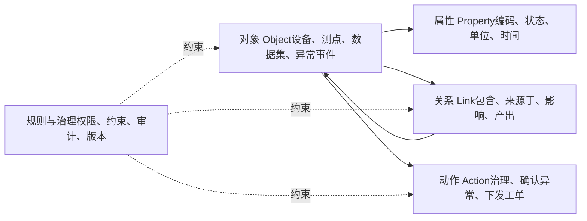
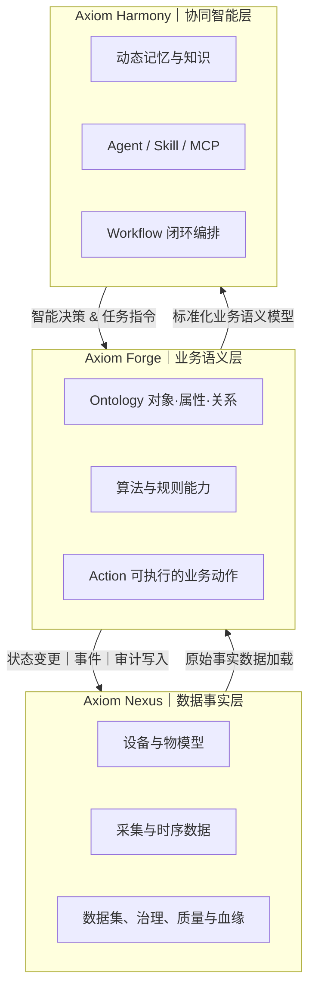

Ontology 学习心得——从数据管理走向业务语义驱动（后端研发视角）

本次 Ontology 学习，让我跳出了传统数据建模的固有认知。核心收获在于厘清了：**Ontology 并非在现有系统之外新增一套独立概念库，而是将分散的业务数据、业务对象、算法能力与系统操作，梳理、整合为统一的业务语义语言，让系统具备理解真实业务、合规高效执行任务的能力**，真正实现从被动数据管理，转向主动的业务语义驱动。

## 一、Ontology 核心认知：业务领域的标准化语义模型

本次学习聚焦的并非哲学层面的本体论，而是信息系统领域的**业务语义本体模型**。其核心价值是对特定业务领域做标准化定义，明确四大核心要素及治理约束，构建人机、系统、智能体可共同理解的统一范式。

Ontology 核心构成体系如下：

以工业业务场景为例：设备、产线、测点、数据集、异常事件、治理任务均为核心业务对象；设备包含测点、数据集来源于采集任务、异常事件影响生产单元，是对象间的核心业务关系；异常确认、工单下发、数据治理则是面向业务的可执行动作；而权限管控、数据约束、操作审计、版本管理，是贯穿全流程的治理规则。

同时，Ontology 与数据库表、物模型、知识图谱**关联但不等同**，各模型职责边界清晰、层层递进：

- **数据库表**：聚焦底层数据的存储、结构化与快速查询，解决数据落地问题。
- **物模型**：专注设备维度，标准化定义设备的基础属性、服务能力与事件触发机制。
- **知识图谱**：核心优势是可视化、结构化表达实体及实体间的关联关系。
- **Ontology**：覆盖全业务域，统一业务对象、属性、关系、动作的定义，同时提供标准化标识、语义解析、动作契约、权限约束与全链路审计能力。

综上，Ontology 绝非现有数据模型的简单更名或叠加，而是构建在数据库、时序数据、知识图谱、算法模型之上的**业务语义中间层**，是人员、应用系统、AI Agent 协同交互的统一业务语言。

## 二、Axiom 三层架构拆解：数据→语义→智能闭环

结合 Axiom 整体架构，我将其三层核心能力总结为：**Nexus 负责可信数据事实、Forge 负责业务语义封装、Harmony 负责智能协同闭环**，三层架构层层依赖、双向联动，形成完整的业务智能体系。

### 1. Nexus：构建可信、标准化的数据底座

Nexus 作为数据锻造引擎，承担全链路数据处理能力，覆盖数据接入、清洗解析、标准化存储、统一接口输出。

当前项目中的物模型管理、设备资产台账、采集任务调度、原始数据、治理后数据集、数据质量指标及数据血缘追溯，均属于该层级的核心基础能力，为上层语义建模提供真实、可信的数据事实支撑。

### 2. Forge：实现数据到可执行业务语义的转化

Forge 是整个架构的**语义中枢**，核心价值并非简单的功能页面可视化，而是依托 Ontology 完成数据的业务化重构。其将 Nexus 层的原始数据，映射为标准化的业务对象、属性与关联关系，同时将零散的算法规则、系统接口，封装为可定义、可治理、可追溯的标准化业务 Action。

例如：传统模式下，“处理设备异常”仅体现为数据库表更新、后端接口调用；而在 Forge 语义体系中，该操作是一套完整的业务动作，包含输入条件、权限校验、执行步骤、状态流转、副作用记录与审计日志，真正让数据操作贴合业务逻辑、可管控、可追溯。

### 3. Harmony：基于统一语义实现 Agent 智能闭环

Harmony 依托 Forge 层的标准化 Ontology 语义，搭建动态知识记忆、能力调度与智能工作流闭环。彻底解决了传统 AI Agent 依赖提示词猜测数据表、字段、接口的痛点，让智能体可精准识别四大核心业务信息：当前处理的核心业务对象、对象间的关联业务关系、当前角色的可执行权限、动作执行后的业务影响。

基于该能力，系统智能不再是浅层的问答交互，而是基于真实业务状态完成分析、决策、执行、反馈的全流程闭环。**Ontology 是 AI Agent 从“被动问答”走向“主动落地业务动作”的核心前提**。

## 三、结合现有项目的落地思考

结合当前项目代码与方案架构来看，Axiom 体系已全面具备 Ontology 落地的前置基础条件，各层级能力已完整覆盖底层数据、语义建模、智能协同三大模块：

- **数据层基础完备**：Nexus 已完整覆盖物模型、设备资产、数据采集、数据集治理、数据质量指标、数据血缘追溯等核心数据能力，提供可信的数据事实底座。
- **智能层能力成型**：Harmony 已搭建知识库、AI Agent、Skill 能力、MCP 协议及 Workflow 工作流闭环，具备智能调度与业务落地能力。
- **全链路闭环基础**：现有架构已同时具备数据事实支撑、业务执行工具、流程编排能力，为后续 Ontology 标准化落地、业务语义统一、智能能力迭代优化提供了完善的前置条件。