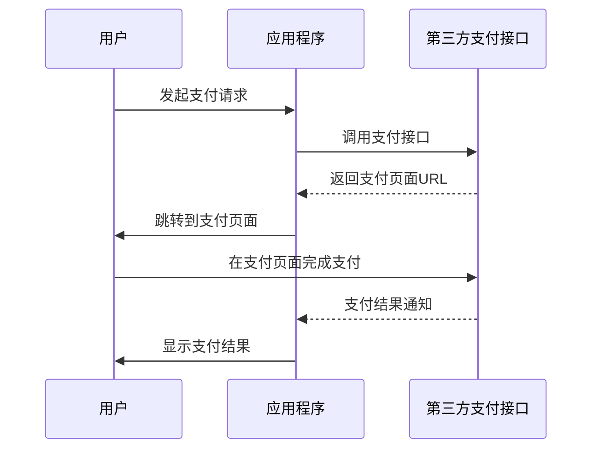
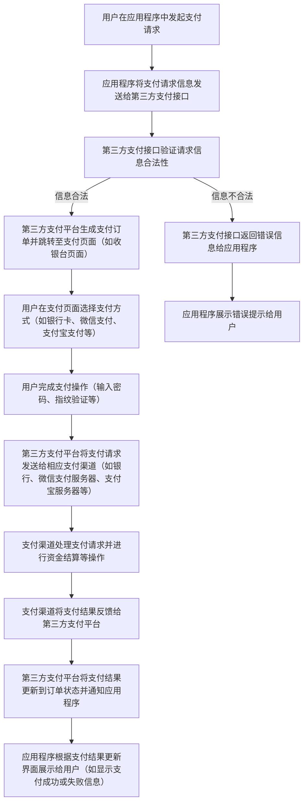
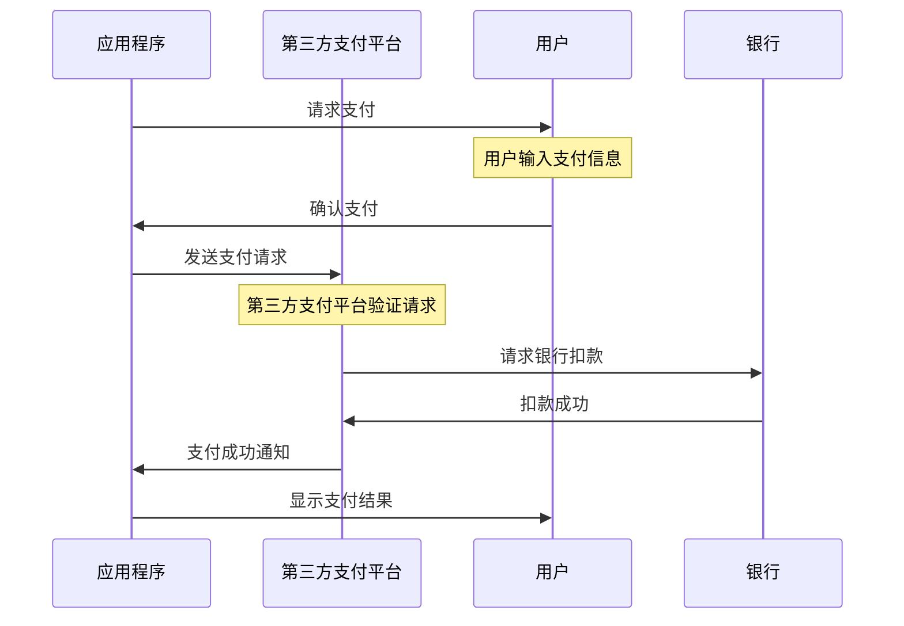

## 对于大模型绘制UML图的调研

在2024年年底，我简单考察了市面上一些大模型对UML图绘制的能力。

## 提示词

提示词都是一样的：`画一个应用程序调用第三方支付接口的流程图`

## 调研的大模型

- [般若](https://banruoai.cn/)
- [豆包](https://www.doubao.com/chat/)
- [KIMI](https://kimi.moonshot.cn/)
- [通义千问](https://tongyi.aliyun.com/)
- [智谱清言](https://chatglm.cn/)
- [ChatGPT](https://chatgpt.com/)

### 般若

这是**时序图**吧？我要的是**流程图**啊。不过般若能直接浏览，这挺好的。




### 豆包

比较符合，不过缺点就是不能预览。




### KIMI

KIMI也不错，比般若体验更好，可以切换markdown的预览和源码，不过这个图严格来说是时序图吧




这个流程图描述了以下步骤：

1. 应用程序（A）向用户（C）请求支付。
2. 用户输入支付信息并确认支付。
3. 应用程序发送支付请求到第三方支付平台（B）。
4. 第三方支付平台验证请求的合法性。
5. 第三方支付平台请求银行（D）扣款。
6. 银行扣款成功后，通知第三方支付平台。
7. 第三方支付平台将支付成功的通知发送给应用程序。
8. 应用程序将支付结果展示给用户。

请注意，实际的支付流程可能会更加复杂，涉及到更多的安全验证、错误处理和异步通信等步骤。这个流程图仅作为一个基本的参考。

### 通义千问

好家伙，直接玩拟人的了……


```
+-------------------+       +---------------------+       +---------------------+
|  用户选择支付     |       | 应用程序准备支付    |       | 应用程序调用支付    |
|  方式并提交订单   | ----> | 请求（创建支付      | ----> | 接口，传递支付      |
|                   |       | 订单，获取支付参数）|       | 参数                |
+-------------------+       +---------------------+       +---------------------+
                                                         |
                                                         v
                                                  +---------------------+
                                                  | 第三方支付平台处理  |
                                                  | 支付请求，返回支付  |
                                                  | 结果或重定向到支付  |
                                                  | 网关页面            |
                                                  +---------------------+
                                                         |
                                                         v
                                                  +---------------------+
                                                  | 用户完成支付        |
                                                  | （通过网银、移动支  |
                                                  | 付应用等）          |
                                                  +---------------------+
                                                         |
                                                         v
                                                  +---------------------+
                                                  | 第三方支付平台通知  |
                                                  | 应用程序支付结果    |
                                                  +---------------------+
                                                         |
                                                         v
                                                  +---------------------+
                                                  | 应用程序验证支付结  |
                                                  | 果，并更新订单状    |
                                                  | 态                  |
                                                  +---------------------+
                                                         |
                                                         v
                                                  +---------------------+
                                                  | 应用程序向用户显示  |
                                                  | 支付成功/失败信息  |
                                                  +---------------------+
```

这个流程图可以分为以下几个关键步骤：

1. 用户在应用程序中选择支付方式并提交订单。
2. 应用程序准备好支付请求，这通常包括创建一个支付订单，并从第三方支付平台获取必要的支付参数。
3. 应用程序调用第三方支付接口，传递支付参数给支付平台。
4. 第三方支付平台处理支付请求，这可能涉及到重定向用户到银行或其他支付网关的页面。
5. 用户通过选定的方式完成支付过程。
6. 第三方支付平台将支付结果通知给应用程序，这通常是通过回调URL或服务器间的通知来完成。
7. 应用程序验证支付结果，并根据支付结果更新订单状态。
8. 应用程序向用户展示支付成功的确认信息或支付失败的消息。

当您绘制这个流程图时，确保使用清晰的箭头来表示数据流和控制流的方向，并且为每个步骤提供简短的描述。如果您需要更详细的流程或者针对特定支付平台的流程图，请提供更多的上下文信息。

### 智谱清言

这位更是重量级……而且图中的单词都是乱码


### ChatGPT

OpenAI也干了，不过图中的单词起码看得清……


## 总结

[般若](https://banruoai.cn/)、[豆包](https://www.doubao.com/chat/)、[KIMI](https://kimi.moonshot.cn/)都挺不错的，看得出对程序员的使用场景有特殊优化，对markdown语法的支持也比较好，反而是之前市面上比较火的通义和CHatGPT直接拉了，这是没想到的。